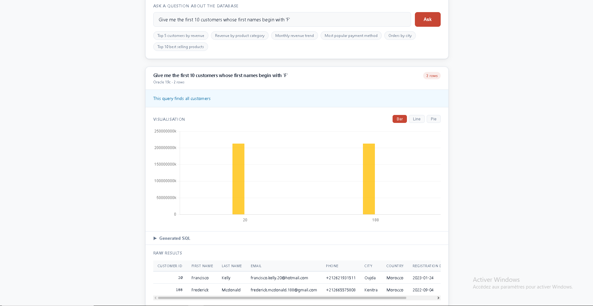

# OracleChat

> AI-powered natural language interface for Oracle Database 19c.
> Ask questions in plain English — get SQL, charts, and explanations.



---

## What it does

You type a question like **"who are the top customers by revenue?"**

OracleChat:
1. Reads your Oracle schema automatically at startup
2. Builds context using RAG (Retrieval-Augmented Generation)
3. Sends the context + question to Google Gemini
4. Gemini generates correct Oracle 19c SQL
5. The SQL is validated and executed safely
6. Results are returned as a Chart.js visualisation + plain explanation

No SQL knowledge required. No schema configuration. Just connect and ask.

---

## Demo

| Question | Result |
|---|---|
| "Who are the top 5 customers by revenue?" | Bar chart ranked by total spend |
| "What is the monthly revenue trend?" | Line chart across 18 months |
| "Which product category sells the most?" | Pie chart by category |
| "Show me their orders" | Follow-up using conversation memory |

---

## Tech stack

| Layer | Technology |
|---|---|
| Database | Oracle Database 19c (CDB/PDB architecture) |
| DB driver | oracledb 2.x (official Oracle Python driver) |
| Backend | Python 3.11 + Flask |
| LLM | Google Gemini 2.5 Flash (free tier) |
| RAG | Custom — Oracle data dictionary + keyword scoring |
| Frontend | Vanilla JavaScript + Chart.js 4 |
| Tests | pytest + unittest.mock |
| CI/CD | GitHub Actions |
| Container | Docker + Gunicorn |

---

## Key features

**Zero-configuration schema discovery**
On startup, OracleChat queries Oracle's data dictionary
(`all_tables`, `all_tab_columns`, `all_constraints`) and builds
a complete schema description automatically. Works on any Oracle
schema — no manual metadata required.

**Column value sampling**
For categorical columns (`STATUS`, `TYPE`, `CATEGORY`, etc.),
the app samples distinct values at startup and injects them into
the LLM prompt. This ensures Gemini generates `WHERE status =
'DELIVERED'` not `'delivered'` — eliminating the most common
zero-result failure mode.

**Conversation memory**
Follow-up questions work naturally. Ask "who are the top customers?"
then "show me their orders" — the second question understands
the context of the first. History is carried by the frontend,
keeping the backend stateless.

**Safety layer**
Every LLM-generated SQL statement passes through a strict validator
before touching the database:
- Only `SELECT` statements are allowed
- All forbidden keywords (`DELETE`, `DROP`, `INSERT`, etc.) are blocked
- `EXPLAIN PLAN` syntax validation before execution
- 500-row result cap
- 10-second query timeout

**Auto chart detection**
Results are automatically rendered as the most appropriate chart
type — line charts for time-series data, pie charts for small
category breakdowns, bar charts for everything else. The user
can switch chart types at any time.

**Retry on zero rows**
If the first SQL attempt returns zero rows, the app automatically
retries with a corrected prompt that emphasises valid column values.

---

## Project structure
```
oraclechat/
├── app/
│   ├── __init__.py          # Flask factory + Oracle pool + schema discovery
│   ├── routes.py            # HTTP endpoints: /, /query, /health, /schema
│   ├── rag.py               # Schema discovery + context builder
│   ├── llm.py               # Gemini integration + SQL extraction
│   ├── executor.py          # Safety layer + query execution
│   ├── formatter.py         # Chart type detection + type coercion
│   └── templates/
│       └── index.html       # Chart.js UI
├── oracle/
│   ├── schema.sql           # E-commerce demo schema
│   ├── seed_data.sql        # Generated demo data (200 customers, 500 orders)
│   ├── generate_seed.py     # Faker-based seed data generator
│   └── schema_metadata.py   # Oracle rules + few-shot SQL examples
├── tests/
│   ├── test_executor.py     # Safety layer unit tests
│   ├── test_llm.py          # SQL extraction unit tests
│   └── test_routes.py       # HTTP endpoint integration tests
├── .github/
│   └── workflows/
│       └── ci_cd.yml        # GitHub Actions CI pipeline
├── Dockerfile
├── requirements.txt
├── run.py
├── ARCHITECTURE.md
└── .env.example
```

---

## Local setup

### Prerequisites

- Oracle Database 19c installed locally (CDB/PDB architecture)
- Python 3.11+
- A free Google Gemini API key from https://aistudio.google.com/app/apikey

### 1 — Clone the repository
```bash
git clone https://github.com/YOUR_USERNAME/OracleChat.git
cd OracleChat
```

### 2 — Install dependencies
```bash
pip install -r requirements.txt
```

### 3 — Configure environment
```bash
cp .env.example .env
```

Edit `.env`:
```
ORACLE_USER=oraclechat
ORACLE_PASSWORD=your_password
ORACLE_DSN=localhost/ORCLPDB
ORACLE_SCHEMA=ORACLECHAT
ORACLE_POOL_MIN=2
ORACLE_POOL_MAX=10
FLASK_ENV=development
FLASK_SECRET_KEY=your_secret_key
GEMINI_API_KEY=your_gemini_key
```

### 4 — Load the demo schema

Connect to Oracle as `oraclechat` user and run:
```sql
@oracle/schema.sql
@oracle/seed_data.sql
```

Or regenerate the seed data:
```bash
python oracle/generate_seed.py
```

### 5 — Run
```bash
python run.py
```

Open `http://localhost:5000`

### 6 — Verify
```
GET  http://localhost:5000/health   → database connection status
GET  http://localhost:5000/schema   → auto-discovered schema
POST http://localhost:5000/query    → ask a question
```

---

## Using OracleChat on your own Oracle schema

OracleChat works on **any Oracle schema** — not just the demo
e-commerce database.

Change three lines in `.env`:
```
ORACLE_USER=your_schema_user
ORACLE_PASSWORD=your_password
ORACLE_SCHEMA=YOUR_SCHEMA_NAME
```

Restart the app. Schema discovery runs automatically. Visit
`/schema` to verify your tables were found, then start asking
questions.

---

## Running the tests
```bash
python -m pytest tests/ -v
```

Tests mock all external services (Oracle, Gemini). No live
database or API key needed to run the test suite.

---

## API reference

### `POST /query`

**Request:**
```json
{
  "question": "who are the top 5 customers by revenue?",
  "history": [
    {
      "question": "previous question",
      "sql": "SELECT ..."
    }
  ]
}
```

**Response:**
```json
{
  "question":    "who are the top 5 customers by revenue?",
  "sql":         "SELECT c.first_name || ' ' || c.last_name ...",
  "explanation": "This query returns the top 5 customers ranked by total spend on delivered orders.",
  "chart_type":  "bar",
  "chart_data":  { "labels": [...], "datasets": [...] },
  "table_data":  [ { "CUSTOMER_NAME": "...", "TOTAL_REVENUE": 43772.07 } ],
  "columns":     ["CUSTOMER_NAME", "TOTAL_REVENUE"],
  "row_count":   5,
  "turn":        { "question": "...", "sql": "..." }
}
```

### `GET /health`

Returns database connection status. Used by Docker and CI/CD.

### `GET /schema`

Returns the auto-discovered schema — all tables, columns, and
row counts. Useful for verifying discovery before asking questions.

---

## CI/CD

Every push to `main` triggers the GitHub Actions pipeline:

1. Install dependencies
2. Lint with flake8
3. Run pytest suite

All external services are mocked — the pipeline runs without
Oracle or Gemini credentials.

---

## Architecture

See [ARCHITECTURE.md](ARCHITECTURE.md) for a full technical
deep-dive covering every design decision, the complete request
lifecycle, and known limitations.

---

## Demo database

The included demo uses a Moroccan e-commerce schema:

| Table | Rows | Description |
|---|---|---|
| CUSTOMERS | 200 | Registered users across 10 Moroccan cities |
| PRODUCTS | 60 | 6 categories: Electronics, Books, Clothing, etc. |
| ORDERS | 500 | 18 months of order history |
| ORDER_ITEMS | ~1,246 | Line items per order |
| PAYMENTS | ~400 | Payment transactions with method and status |

---

## Built by

EMSI Morocco engineering student.

Certifications:
- Oracle Database 19c Administrator Certified Professional (1Z0-083)
- Oracle Cloud Infrastructure Data Science Professional
- Oracle Cloud Infrastructure DevOps Professional

---

## License

MIT